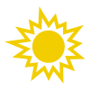

<div id="top"></div>


<!-- PROJECT SHIELDS -->
[![Contributors][contributors-shield]][contributors-url]
[![Forks][forks-shield]][forks-url]
[![Stargazers][stars-shield]][stars-url]
[![Issues][issues-shield]][issues-url]
[![MIT License][license-shield]][license-url]


<!-- PROJECT LOGO -->
<br />
<div align="center">
  <a href="https://github.com/garrrrikkotua/Morningly">
    
  </a>

  <h3 align="center">Morningly</h3>

  <p align="center">
    Your open-source alternative to launch a new Morning Brew
    <br />
    <a href="https://github.com/othneildrew/Best-README-Template"><strong>Explore the docs »</strong></a>
    <br />
    <br />
    <a href="https://github.com/othneildrew/Best-README-Template">View Demo</a>
    ·
    <a href="https://github.com/othneildrew/Best-README-Template/issues">Report Bug</a>
    ·
    <a href="https://github.com/othneildrew/Best-README-Template/issues">Request Feature</a>
  </p>
</div>


<!-- ABOUT THE PROJECT -->
## About The Project

[![Product Name Screen Shot][product-screenshot]](https://example.com)

This is an open-source platform to launch your own Morning Brew like newsletter. It has all needed features built-in: creating new issues, web portal, role management, delayed sending, subscribe, unsubscribe, automated market info fetching and other cool stuff.

Originally, I used this project internally to host my own russian-speaking version of Morning Brew. I got around 200 users, send more than 10K emails and more than 60% opening rate, so this platform is quite real world tested :)

### Built With

Technology stack is actually pretty simple. It is all powered by Django.


<!-- GETTING STARTED -->
## Getting Started

### Prerequisites
To start using this tool, you probably should need Python or Docker.

### Installation

_Below is an example of how you can instruct your audience on installing and setting up your app. This template doesn't rely on any external dependencies or services._

1. Clone the repo
   ```sh
   git clone https://github.com/garrrikkotua/Morningly.git
   ```
2. Install pip packages
   ```sh
   pip install -r requirements.txt
   ```
3. Initialize the app with a simple SQLite database
   ```sh
   python manage.py migrate
   ```
4. Create a superuser for your app
   ```sh
   python manage.py createsuperuser
   ```
5. Start the app
   ```sh
   python manage.py runserver
   ```
6. Go to the localhost:8000 to test it!

<!-- USAGE EXAMPLES -->
## Usage
To use this app in the production, your probably should get a Mailgun API key. It is the easiest way to send bulk emails.

You can found a template how to configure Mailgun in `email_website/prod_settings.py`.

Docker, Dokku and Heroku deployment tutorials are to be added soon.

<!-- CONTACT -->
## Contact

Igor Kotua - [@garrrikkotua](https://twitter.com/garrrikkotua) - kotuaigor@gmail.com

Project Link: [https://github.com/garrrikkotua/Morningly](https://github.com/garrrikkotua/Morningly)

<!-- MARKDOWN LINKS & IMAGES -->
<!-- https://www.markdownguide.org/basic-syntax/#reference-style-links -->
[contributors-shield]: https://img.shields.io/github/contributors/garrrrikkotua/Morningly.svg?style=for-the-badge
[contributors-url]: https://github.com/garrrrikkotua/Morningly/graphs/contributors
[forks-shield]: https://img.shields.io/github/forks/garrrrikkotua/Morningly.svg?style=for-the-badge
[forks-url]: https://github.com/garrrrikkotua/Morningly/network/members
[stars-shield]: https://img.shields.io/github/stars/garrrrikkotua/Morningly.svg?style=for-the-badge
[stars-url]: https://github.com/garrrrikkotua/Morningly/stargazers
[issues-shield]: https://img.shields.io/github/issues/garrrrikkotua/Morningly.svg?style=for-the-badge
[issues-url]: https://github.com/garrrrikkotua/Morningly/issues
[license-shield]: https://img.shields.io/github/license/garrrrikkotua/Morningly.svg?style=for-the-badge
[license-url]: https://github.com/garrrrikkotua/Morningly/blob/master/LICENSE.txt
[linkedin-shield]: https://img.shields.io/badge/-LinkedIn-black.svg?style=for-the-badge&logo=linkedin&colorB=555
[product-screenshot]: static/email_website/morningly_landing_image.png
